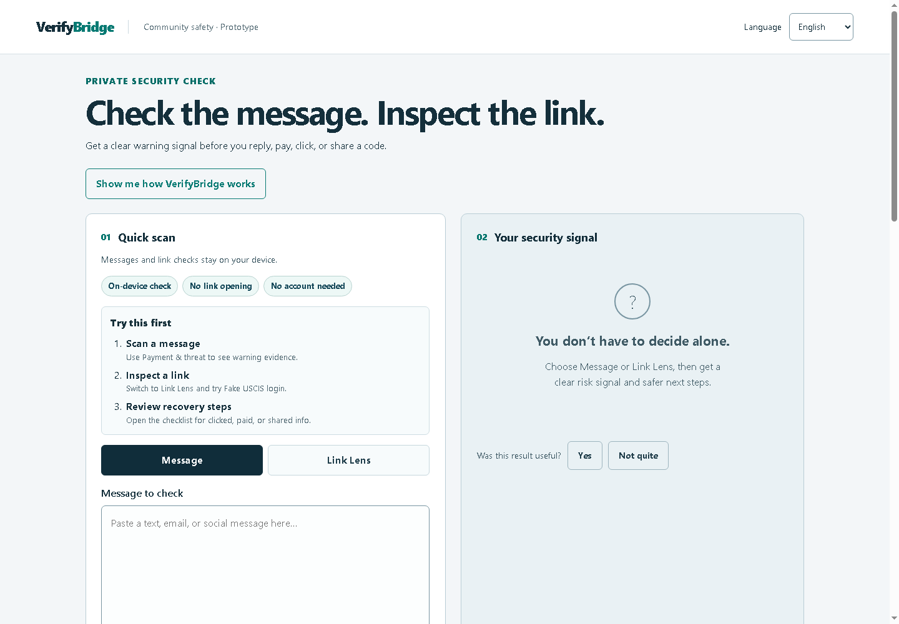

# VerifyBridge

## Live demo

[Open VerifyBridge](https://verifybridgecheck.com/)

[Watch the short demo](media/verifybridge-demo.mp4)

A browser-based, multilingual scam-message screening prototype for newcomer communities. Built for the OUPI Cyber Clinic Contest 2026, targeting the AI-enabled cybersecurity solution for underserved communities category.

## Run locally

Install Node.js 20 or newer, then run `node server.mjs` from this folder. Open http://127.0.0.1:4173. No package installation or API key is required. The checked-in model is ready to use. Run `node --test tests/engine.test.mjs` for regression tests and `node scripts/train.mjs` to reproduce the model from `data/training.json`. Equivalent npm scripts are also provided.

## Optional live link reputation

Link Lens always runs its address-structure check locally. The optional live check sends only the submitted link to the `/api/scan` endpoint, which can query Google Web Risk for malware, social engineering, and unwanted software signals. Configure the server-side `WEB_RISK_API_KEY` secret in the hosting provider; never place the key in `dist/`, client JavaScript, source control, or browser-visible configuration. If the secret or endpoint is unavailable, Link Lens remains usable with the local result and explains that the live signal could not be retrieved.

For production setup, enable Web Risk and billing in the `verifybridge` Google Cloud project, create a restricted API key for Web Risk only, and store it as the Cloudflare Worker secret `WEB_RISK_API_KEY`. Never commit the key or place it in browser code. If a key has ever been pasted into chat, rotate it in Google Cloud Console, update the Worker secret, and redeploy before public use.

## What works

- Guided examples demonstrate a message warning, Link Lens, and recovery guidance. Results include private, in-browser usefulness feedback without storing message contents.

- Explanations for each warning, highlighted original wording with surrounding context, and tailored verification steps in all four languages. Suspect links remain non-clickable text.
- Optional FTC recovery guidance for people who already paid or shared information.
- A reproducible 36-case synthetic diagnostic separate from training: run `node scripts/evaluate.mjs` and read `EVALUATION.md`. It exposes false alarms and missed scams; it is not an independent or representative benchmark. The detector recognizes a small set of explicit safety-advice patterns, requires an action request with agency-plus-fee language, and checks a limited family-new-number-plus-money pattern; it still cannot reliably understand all negation or context.

- Paste up to 10,000 characters and get a local warning signal automatically after a brief pause; the Check button still works for manual review.
- Switch interface and explanations between English, Spanish, Vietnamese, and Simplified Chinese. Detection checks all supported patterns regardless of selected interface language.
- Detect combinations of payment, threats, urgency, sensitive information, family pressure, promised outcomes, and a narrow set of government lookalike domains.
- Get a secondary signal from a real multinomial Naive Bayes classifier trained on 48 labeled synthetic examples (6 per class per language).
- Try three fictional demonstrations in each language, with an on-screen path that explains the intended warning flow quickly.
- Switch to Link Lens and try three URL demonstrations: a fake USCIS login, a shortened link, and an official USCIS page.
- Review plain-language explanations for each risk signal, including the actual URL host and registered domain in Link Lens.
- Open the recovery checklist for steps to take after clicking, paying, sharing a login code, or giving personal information.
- Copy a message-free safety plan for use outside the checker, with contextual USCIS and FTC verification links when government impersonation signs appear.
- Install the site as a lightweight app and reuse the core checker after its files have been cached for offline access.
- Screen locally without saving messages, fetching their links, or sending their text to an external API. Hosting providers still receive ordinary website requests; external resource links open external sites when selected.

## Architecture

`dist/index.html` and `style.css` provide the interface. `app.js` handles state using text-only DOM insertion, `i18n.js` supplies reviewed-by-author but not independently reviewed translations, and `engine.js` performs inference. `scripts/train.mjs` learns token likelihood ratios using Laplace smoothing and exports `dist/model.json`. Latin-script word tokens and Chinese character unigrams/bigrams feed one pooled classifier. Its score is uncalibrated and is not displayed as a probability. A model-only signal can cause “Pause and verify,” never “Strong warning signs.” Strong warnings come from explicit rules. “No clear warning signs” never means “safe.”

This first implementation replaces the earlier proposed translate-then-classify/FastAPI architecture with direct multilingual, on-device detection. It has no backend or third-party translation dependency. This reduces deployment work and disclosure of sensitive text, while limiting semantic coverage. It is not equivalent to general translation or a large language model.

## Limitations and honest evaluation

This is a hackathon prototype, not a validated consumer security product. Synthetic training examples contain no real user data. Examples in different languages are related translations, not independent observations. There is no representative held-out benchmark, calibrated confidence, or production accuracy claim. Regression tests are engineering checks, not an accuracy estimate.

Known failures include incomplete slang/obfuscation and quoted-context coverage, unsupported languages, uneven Chinese token behavior, and a very narrow lookalike-domain rule. The checker handles selected negated advice, educational examples, character substitutions, zero-width characters, and spaced-out payment wording, but those defenses are not exhaustive. It cannot authenticate agencies, people, payment requests, or websites; inspect linked content; understand legal status; or give legal advice. An ordinary legitimate fee message can trigger a review. Resource guidance is U.S.-focused. Community/native-speaker review remains pending.

Before public use: collect independently labeled, consented or public examples; separate related templates across splits; evaluate false positives and false negatives by language and scam type; test negation and quoted messages; perform keyboard, screen-reader, mobile and 200% zoom testing; seek community review.

## Sources and attribution

Warning-sign selection and general verification guidance were informed by [FTC immigration scam guidance](https://consumer.ftc.gov/articles/how-avoid-immigration-scams-and-get-real-help) and [USCIS Avoid Scams](https://www.uscis.gov/avoid-scams). Neither agency endorses this project. Dataset messages are fictional, not quotations or collected reports. Interface translations require independent community review. The architecture implements the standard multinomial Naive Bayes algorithm directly; there are no third-party runtime packages, copied templates, remote fonts, images, or assets. Node.js is the development runtime and is separately licensed.

The optional `check_scam_message` WebMCP tool shares the visible checking flow. A supported live WebMCP validation context was not available during this build; tool registration and interaction remain unverified. Normal usage does not require WebMCP.

## License

Source, authored interface text, and synthetic data are provided under the MIT license in `LICENSE`.
